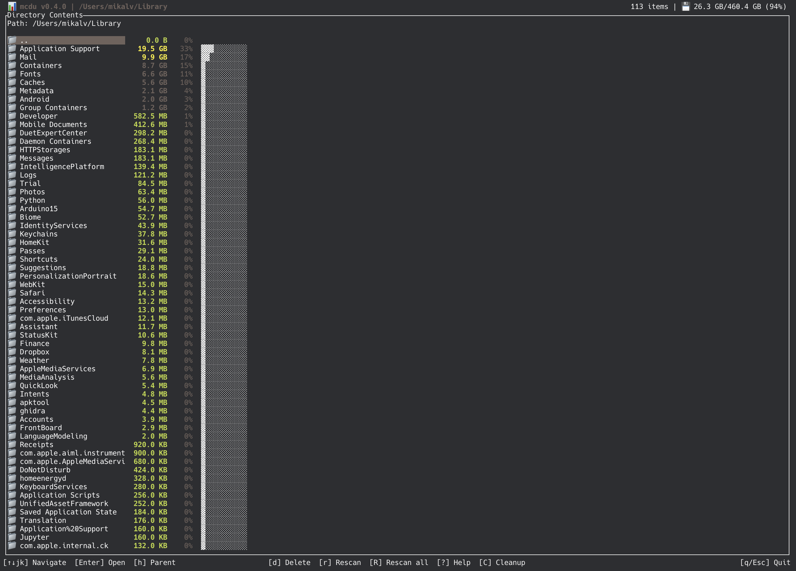
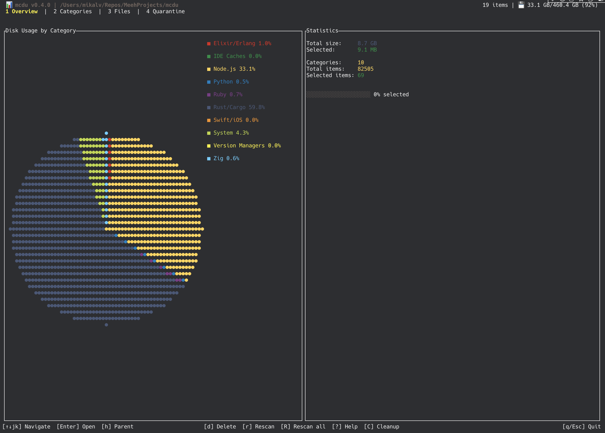
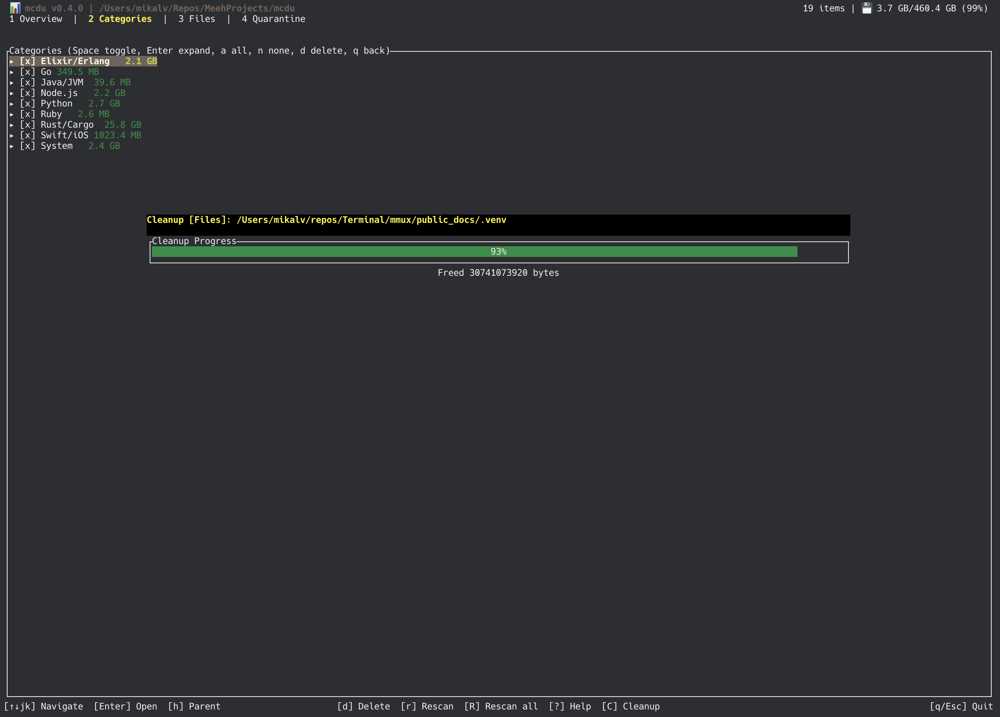

# mcdu - Modern Disk Usage Analyzer & Developer Cleanup Tool

A fast, modern disk usage analyzer with an integrated developer cleanup tool, written in Rust. Think **ncdu** meets **CCleaner for developers**.



## Features

- **Disk usage browser** - Navigate your filesystem with vim-style keybindings, color-coded by size
- **Developer cleanup** - Scan for build artifacts, caches, and reclaimable space across 18+ ecosystems
- **Safe deletion** - Double-confirmation dialogs, dry-run mode, and JSON audit logging
- **Fast scanning** - Background async scanning with live progress, jwalk parallelism for cleanup
- **Cross-platform** - macOS (APFS) and Linux (ext4, btrfs, xfs)

## Installation

```bash
cargo install mcdu
```

### From source

```bash
git clone https://github.com/mikalv/mcdu.git
cd mcdu
cargo build --release
./target/release/mcdu
```

## Usage

### Disk Usage Browser

```bash
mcdu              # browse current directory
mcdu /path/to     # browse specific directory
```


| Key | Action |
|-----|--------|
| `j/k` or arrows | Navigate |
| `Enter/l` | Enter directory |
| `Backspace/h` | Go up |
| `d` | Delete selected |
| `r` | Rescan selected |
| `R` | Rescan all |
| `C` | Switch to cleanup mode |
| `?` | Help |
| `q` | Quit |

Color coding: red (>100 GB), yellow (>10 GB), cyan (>1 GB), green (<1 GB).

### Developer Cleanup

```bash
mcdu cleanup            # scan default paths
mcdu cleanup ~/repos    # scan specific path
```

Scans for build artifacts, caches, and other reclaimable disk space across your development tools.





| Key | Action |
|-----|--------|
| `Tab` / `1-4` | Switch tabs (Overview, Categories, Files, Quarantine) |
| `j/k` or arrows | Navigate |
| `Space` | Toggle selection |
| `a` / `n` | Select all / none |
| `d` | Delete selected |
| `D` | Dry run |
| `C` | Rescan |
| `q` | Back to disk browser |

**Supported ecosystems:** Rust/Cargo, Node.js, Python, Go, Java/JVM, Elixir/Erlang, Ruby, PHP, .NET, Zig, Deno, Swift/iOS, Docker, Kubernetes, Terraform, IDE caches, browser caches, system caches (Homebrew, Xcode, Trash).

**Default scan paths:** `~/Downloads`, `~/Projects`, `~/Code`, `~/Developer`, `~/repos`, `~/dev`, `~/src`, `~/workspace`

### Custom Configuration

Place a config file at `~/.config/mcdu/cleanup.toml`:

```toml
scan_paths = ["~/myprojects", "~/work"]

[[rules]]
name = "custom-cache"
category = "Custom"
pattern = "**/.cache"
path = "${HOME}/myprojects"
match_type = "directory"
```

Rules from the config are merged with built-in defaults.

## Architecture

```
crates/
  mcdu-core/     # Scanner, cleanup rules, config, platform detection
  mcdu-tui/      # Ratatui app state, UI rendering, keybindings
  mcdu/          # CLI binary (clap), entry point
```

### Key design decisions

- **Async scanning** - Directory scanning in background thread via mpsc channels
- **Subtree pruning** - `filter_entry` skips node_modules/target/etc. entirely during cleanup scan
- **Safe defaults** - Final confirm defaults to Cancel, all deletions are audit-logged
- **Workspace crates** - Core logic separated from TUI and CLI for testability

## Dependencies

- **ratatui** + **crossterm** - Terminal UI
- **walkdir** / **jwalk** - Directory traversal (jwalk for parallel cleanup scanning)
- **clap** - CLI argument parsing
- **serde** / **toml** - Configuration
- **rayon** - Parallel processing

## Platform Support

- macOS - Full support with APFS compatibility
- Linux - Full support (ext4, btrfs, xfs, etc.)

## Building & Testing

```bash
cargo build            # debug build
cargo build --release  # optimized release build
cargo test             # run all workspace tests
```

## License

MIT

## Acknowledgments

Inspired by [ncdu](https://dev.yorhel.nl/ncdu) and the need to reclaim disk space eaten by `node_modules` and `target/` directories.
